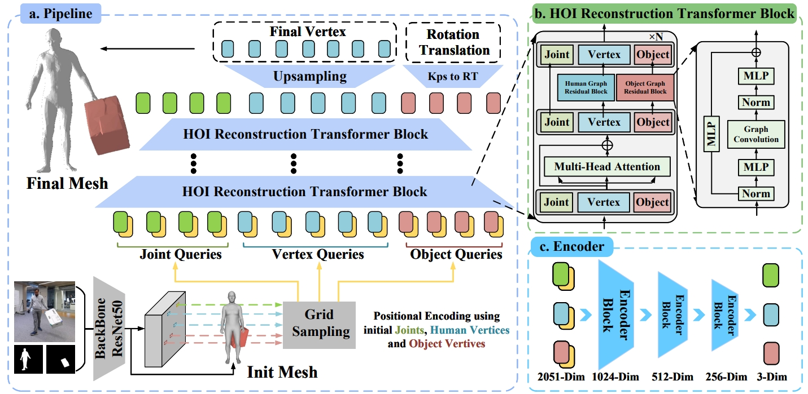
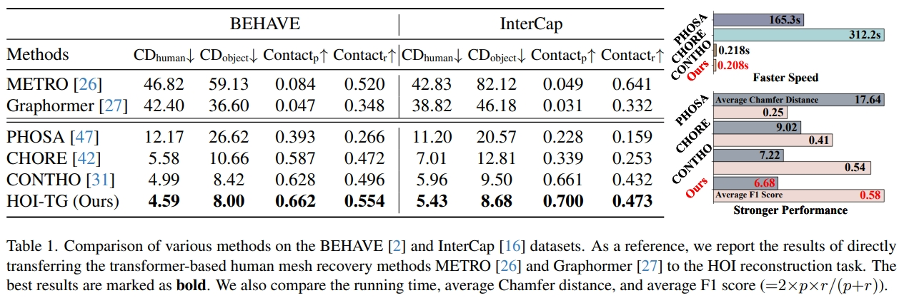
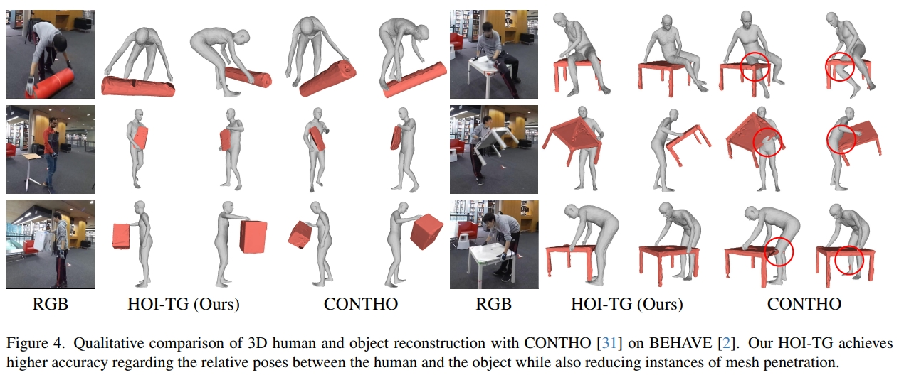

<div align="center">

# <b>HOI-TG</b>: End-to-End HOI Reconstruction Transformer with Graph-based Encoding

<b>[Zhenrong Wang](https://zhenrongwang.github.io/)<sup>1</sup></b>, <b>[Qi Zheng](https://qizhust.github.io/)<sup>1</sup></b>, <b>[Sihan Ma](https://xymsh.github.io/)<sup>2</sup></b>, <b>Maosheng Ye<sup>3</sup></b> , <b>Yibing Zhan<sup>4</sup></b>, <b>Dongjiang Li<sup>4</sup></b>

<p align="center">
    
    &nbsp;&nbsp;&nbsp;&nbsp;
    
    &nbsp;&nbsp;&nbsp;&nbsp;
    
    &nbsp;&nbsp;&nbsp;&nbsp;
    
</p>

<b><sup>1</sup>Shenzhen University</b>, <b><sup>2</sup>University of Sydney</b>
<b><sup>3</sup>DeepRoute.AI</b>, <b><sup>4</sup>JD Explore Academy</b>


<a href='https://hoi-tg.github.io/'></a>
<a href="https://arxiv.org/pdf/2503.06012"></a>


<h2>CVPR 2025<span style="color: red;"> Highlight</span></h2>



</div>

**HOI-TG** is an end-to-end transformer framework for 3D human-object interaction (HOI) reconstruction from a single image. It innovatively utilizes self-attention to **implicitly model** the contact between humans and objects. The model achieves **state-of-the-art** performance on the BEHAVE and InterCap datasets, improving human and object reconstruction accuracy by **8.9%** and **8.6%** on InterCap, respectively. This demonstrates the robust integration of global posture and fine-grained interaction modeling without explicit constraints.
<br/>


## Installation

Setup the environment
``` 
# Initialize conda environment
conda create -n hoitg python=3.9
conda activate hoitg

# Install PyTorch
pip install https://download.pytorch.org/whl/cu113/torch-1.11.0%2Bcu113-cp39-cp39-linux_x86_64.whl

pip install https://download.pytorch.org/whl/cu113/torchvision-0.12.0%2Bcu113-cp39-cp39-linux_x86_64.whl#sha256=6c63b9abe2849efed27b199b6d459a21bb01708c720db2fca5ebd941b2f00db8

# Install all remaining packages
pip install -r requirements.txt
```

## Data
You can refer to [CONTHO](https://github.com/dqj5182/CONTHO_RELEASE) for data preparation. We added a graph directory under **data/base_data** to store the adjacency matrix data, and modified the **object_model/behave(intercap)/_info.json** file to add the object's adjacency matrix information. Other data preparation is consistent with CONTHO.

You need to follow directory structure of the `data` as below.
```
${ROOT} 
|-- data  
|   |-- base_data
|   |   |-- annotations
|   |   |-- backbone_models
|   |   |-- human_models
|   |   |-- object_models
|   |   |-- graph
|   |-- BEHAVE
|   |   |-- dataset.py
|   |   |-- sequences
|   |   |   |-- Date01_Sub01_backpack_back
|   |   |   |-- Date01_Sub01_backpack_hand
|   |   |   |-- ...
|   |   |   |-- Date07_Sub08_yogamat
|   |-- InterCap
|   |   |-- dataset.py
|   |   |-- sequences
|   |   |   |-- 01
|   |   |   |-- 02
|   |   |   |-- ...
|   |   |   |-- 10
```

You can find detailed data download links in [CONTHO](https://github.com/dqj5182/CONTHO_RELEASE?tab=readme-ov-file#data), but please note that the modification of the object_model/behave(intercap)/_info.json file will be skipped when unzipping.

## Running HOITG

### Train 
To train HOITG on [BEHAVE](https://virtualhumans.mpi-inf.mpg.de/behave/) or [InterCap](https://intercap.is.tue.mpg.de/) dataset, please run
```
bash train.sh
``` 

### Test
To evaluate HOITG on [BEHAVE](https://virtualhumans.mpi-inf.mpg.de/behave/) or [InterCap](https://intercap.is.tue.mpg.de/) dataset, please run
```
bash test.sh
```

### Results
Here, we show the impressive performance of HOITG. HOITG has **powerful performance** and **superior reasoning speed**. The specific results can be seen in the figure below.
<p align="center">  
  
</p>
<p align="center">  
  
</p>


## Technical Q&A
We recommend using a smaller batch size for training. If you want to increase the batch size to increase training efficiency, you need to adjust lr appropriately. For details, please refer to [Issue](https://github.com/dqj5182/CONTHO_RELEASE/issues/10)

If you have any questions you want to discuss, you are welcome to raise an issue or send me an [Email](w2271762553@gmail.com) directly.

## Acknowledgement
We thank [CONTHO](https://github.com/dqj5182/CONTHO_RELEASE) for integrating code framework.

I am very grateful to Daniel Sungho Jung, the author of CONTHO, for being willing to discuss the relevant experimental details with me.

## Reference
```  
@misc{wang2025endtoendhoireconstructiontransformer,
      title={End-to-End HOI Reconstruction Transformer with Graph-based Encoding}, 
      author={Zhenrong Wang and Qi Zheng and Sihan Ma and Maosheng Ye and Yibing Zhan and Dongjiang Li},
      year={2025},
      eprint={2503.06012},
      archivePrefix={arXiv},
      primaryClass={cs.CV},
      url={https://arxiv.org/abs/2503.06012}, 
}
```  
